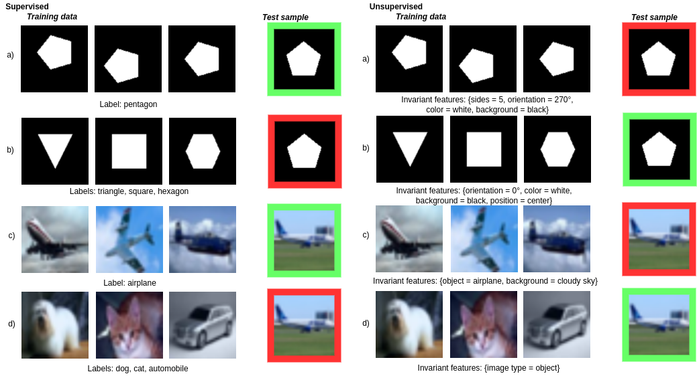

# Data Invariants

Code used for our paper ["Data Invariants to Understand Unsupervised Out-of-Distribution Detection"](https://link.springer.com/chapter/10.1007/978-3-031-19821-2_8), accepted at the European Conference on Computer Vision 2022.



This repository contains the code to obtain the results for the methods MahaAD, DN2 and DDV. Links to code used for other methods are provided below.

### Abstract

Unsupervised out-of-distribution~(U-OOD) detection has recently attracted much attention due to its importance in mission-critical systems and broader applicability over its supervised counterpart. 
Despite this increased attention, U-OOD methods suffer from important shortcomings.
By performing a large-scale evaluation on different benchmarks and image modalities, we show in this work that most popular state-of-the-art methods are unable to consistently outperform a simple and relatively unknown anomaly detector based on the Mahalanobis distance~(MahaAD). 
A key reason for the inconsistencies of these methods is the lack of a formal description of U-OOD.
Motivated by a simple thought experiment, we propose a characterization of U-OOD based on the invariants of the training dataset. 
We show how this characterization is unknowingly embodied in the top-scoring MahaAD method, thereby explaining its quality. Furthermore, our approach can be used to interpret predictions of U-OOD detectors and provides insights into good practices for evaluating future U-OOD methods.

### Reproducing experiments

The experiments on <em>uni-class</em> (CIFAR10, CIFAR100) and <em>shift-low-res</em> (CIFAR10:SVHN) are included by default, as their datasets are available directly through torchvision. Links to download the other datasets are provided below.

For example, run all 10 CIFAR10 experiments using MahaAD with an EfficientNet-b4 with
```
python3 mahaad.py --numExps 10 --task uniclass --efnet 4 --architecture en --bs 32
```
Or DN2 on the CIFAR100 task with
```
python3 dn2.py --numExps 20 --task unisuper
```
Or <em>shift-low-res</em> with DDV using
```
python3 ddv.py --numExps 2 --task shift-lowres
```

### Code for other methods
Results for the other methods were obtained using their official implementations, available at: <br>
MSCL: https://github.com/talreiss/Mean-Shifted-Anomaly-Detection <br>
MHRot: https://github.com/hendrycks/ss-ood <br>
SSD: https://github.com/inspire-group/SSD <br>
IC/HierAD: https://github.com/boschresearch/hierarchical_anomaly_detection <br>
Glow: https://github.com/y0ast/Glow-PyTorch <br>
CFlowAD: https://github.com/gudovskiy/cflow-ad

### Data
Other experiments require external datasets, which can be downloaded from: <br>
MVTec AD: https://www.mvtec.com/company/research/datasets/mvtec-ad <br>
NIH: https://github.com/rsummers11/CADLab/tree/master/CXR-Binary-Classifier <br>
DRD: https://www.kaggle.com/c/diabetic-retinopathy-detection <br>
DomainNet: http://ai.bu.edu/M3SDA/ <br>

### Figures
Code to recreate figures 6 & 7, as far as possible for standalone code, is provided in the figures folder.

### Citation

If you find this work helpful, consider citing it using

```
@inproceedings{doorenbos2022data,
  title={Data invariants to understand unsupervised out-of-distribution detection},
  author={Doorenbos, Lars and Sznitman, Raphael and M{\'a}rquez-Neila, Pablo},
  booktitle={European Conference on Computer Vision},
  pages={133--150},
  year={2022},
  organization={Springer}
}
```
